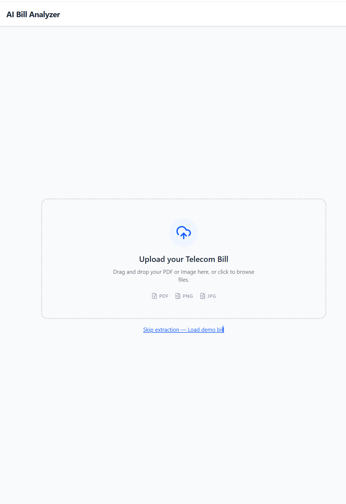
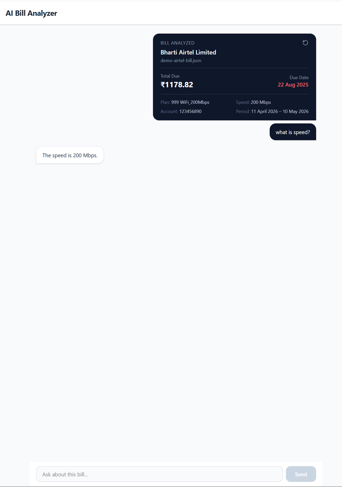

# AI Bill Analyzer

An AI-powered telecom bill analyzer that extracts structured data from bills and enables conversational Q&A — built with Next.js and Google Gemini.

## Screenshots

### Upload


### Chat


## Features
- 📄 Upload telecom bills as PDF or image (JPG/PNG)
- 🤖 AI extraction using Google Gemini 2.5 Flash
- 💬 Streaming conversational Q&A about your bill
- 🔒 No file sent during chat — only extracted JSON used as context
- ⚡ Built with Vercel AI SDK v6

## Tech Stack
- **Framework** — Next.js 16 (App Router)
- **AI SDK** — Vercel AI SDK v6
- **LLM** — Google Gemini 2.5 Flash
- **Schema Validation** — Zod
- **Styling** — Tailwind CSS v4

## Getting Started

### Prerequisites
- Node.js 18+
- Google Gemini API key — [Get one here](https://aistudio.google.com)

### Installation
```bash
git clone https://github.com/rengha93/ai-bill-analyzer.git
cd ai-bill-analyzer
npm install
```

### Environment Variables
Create a `.env.local` file:
```env
GOOGLE_GENERATIVE_AI_API_KEY=your_api_key_here
```

### Run
```bash
npm run dev
```

Open [http://localhost:3000](http://localhost:3000)
