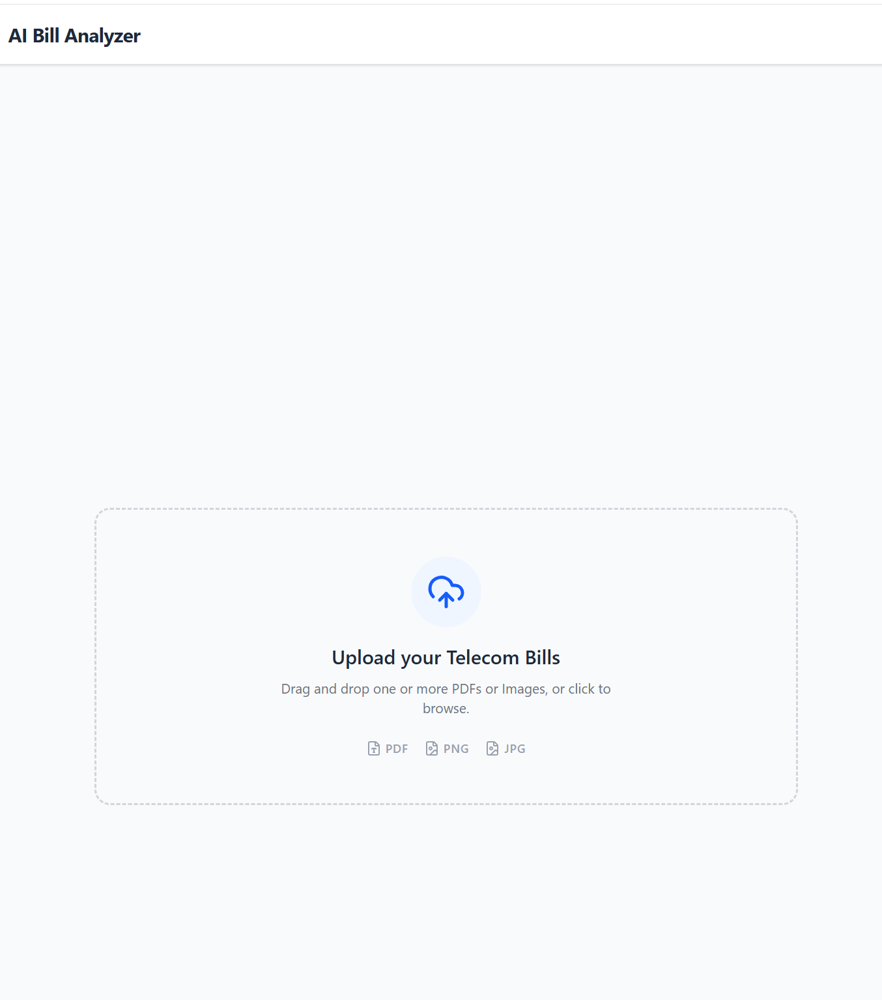
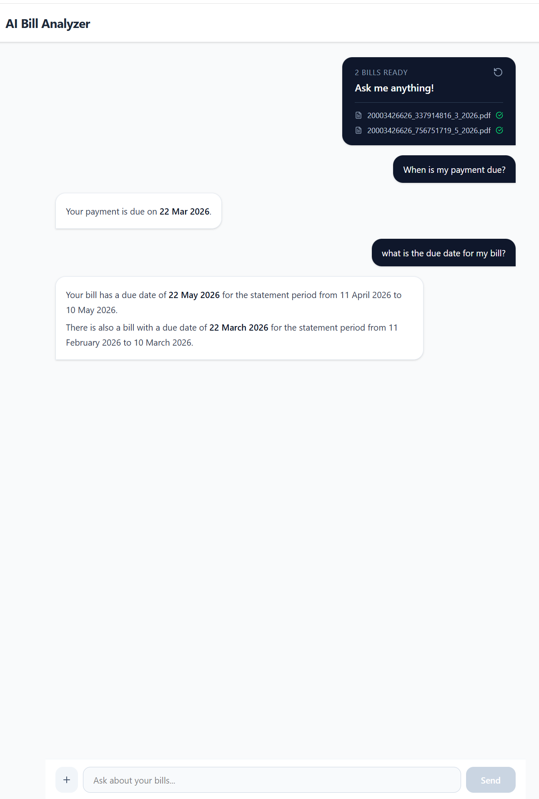

# AI Bill Analyzer

An AI-powered telecom bill analyzer enabling semantic Q&A across multiple bills using a full RAG pipeline — built with Next.js, Google Gemini, and Pinecone.

## Screenshots

### Upload


### Chat


## Features
- 📄 Upload multiple telecom bills as PDF, JPG, or PNG
- 🔍 Full RAG pipeline — PDF extraction, chunking, vector embeddings, Pinecone storage
- 💬 Streaming conversational Q&A across all uploaded bills
- 🧠 Semantic search — surfaces fine-print details (late fees, GST breakdown, payment terms)
- 📊 Cross-document queries — compare charges across multiple months
- 🔒 Session-isolated retrieval — no data pollution across sessions
- ⚡ Token-efficient — file never re-sent during chat, only relevant chunks retrieved

## Tech Stack
- **Framework** — Next.js 16 (App Router)
- **AI SDK** — Vercel AI SDK v6
- **LLM** — Google Gemini 2.5 Flash
- **Embeddings** — Google Gemini Embeddings
- **Vector DB** — Pinecone
- **Styling** — Tailwind CSS v4

## Architecture

```
Upload PDF/Image
↓
Text extraction (unpdf) → Chunking → Google Embeddings → Pinecone (store)

User asks question
↓
Question embedded → Pinecone semantic search → Relevant chunks retrieved
↓
Chunks + question → Gemini 2.5 Flash → Streaming response
```

## Getting Started

### Prerequisites
- Node.js 18+
- Google Gemini API key — [Get one here](https://aistudio.google.com)
- Pinecone account — [Get one here](https://pinecone.io) (free tier)

### Installation
```bash
git clone https://github.com/rengha93/ai-bill-analyzer.git
cd ai-bill-analyzer
npm install
```

### Environment Variables
Create a `.env.local` file:
```env
GOOGLE_GENERATIVE_AI_API_KEY=your_gemini_api_key
PINECONE_API_KEY=your_pinecone_api_key
```

### Pinecone Setup
Create an index in Pinecone dashboard:
- **Name:** `bill-analyzer`
- **Dimensions:** `3072`
- **Metric:** `cosine`

### Run
```bash
npm run dev
```

Open [http://localhost:3000](http://localhost:3000)

## Roadmap
- [x] MVP 1.0 — Single bill extraction + streaming Q&A
- [x] MVP 2.0 — Multi-document RAG pipeline with Pinecone + semantic search
- [ ] MVP 3.0 — AI Agents + tool calling